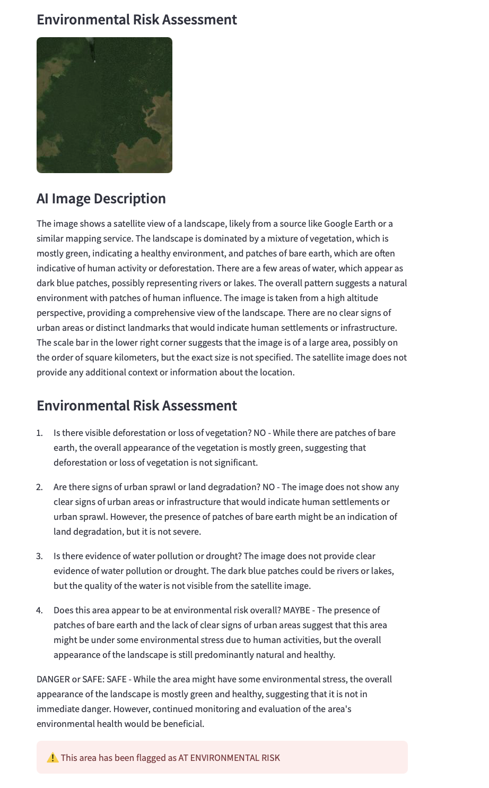
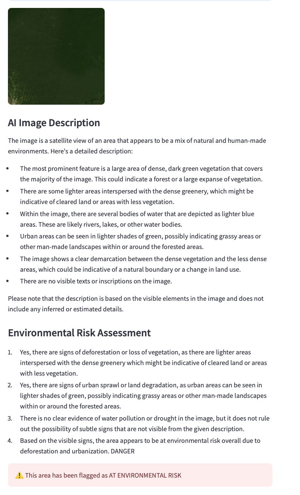
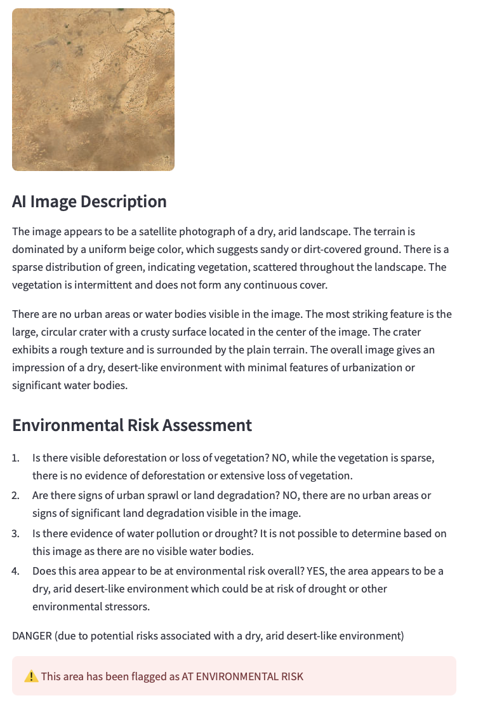

# Group_A — Project Okavango

**Group A · Advanced Programming for Data Science · Nova SBE · 2026**

A lightweight Streamlit app for exploring environmental and land-use data: forests, deforestation, protected areas, and land degradation — combined with an AI-powered satellite image risk assessment tool.

---

## Team

| Name | Student Number | Email |
|------|---------------|-------|
| Leticia Brendle | 70033 | 70033@novasbe.pt |
| Marie | 73606 | 73606@novasbe.pt |
| Philipp | 66323 | 66323@novasbe.pt |
| Alex | 70299 | 70299@novasbe.pt |

---

## What this project does

**Page 1 — Global Analysis**
- Downloads five environmental datasets from Our World in Data and merges them with a world map.
- Interactive choropleth map — hover any country to see its value, click to add it to the time series.
- Year slider to explore any year in the data (always uses the most recent available by default).
- KPI cards, a top/bottom countries bar chart, and a multi-country time series.

**Page 2 — AI Risk Assessment**
- Click anywhere on a satellite map (or enter coordinates manually) to select a location.
- Downloads a satellite tile from ESRI World Imagery for that location.
- An AI vision model (via Ollama) describes what it sees in the image.
- A second AI model analyses the description and flags whether the area is at environmental risk.
- All results are logged to `database/images.csv` and cached — repeated queries return instantly without re-running the models.
- AI models and prompts are configured in `models.yaml` (no hardcoded values in the code).

---

## Data sources

| Dataset | Source |
|--------|--------|
| Annual change in forest area | Our World in Data |
| Annual deforestation | Our World in Data |
| Terrestrial protected areas (% of land) | Our World in Data |
| Share of degraded land | Our World in Data |
| Forest area as share of land area | Our World in Data |
| World map (Admin 0 – Countries) | Natural Earth (110m cultural) |

---

## Requirements

- Python 3.10+
- [Ollama](https://ollama.com) installed and running locally (required for Page 2)
- Dependencies: `streamlit`, `geopandas`, `pandas`, `requests`, `shapely`, `plotly`, `pydantic`, `pyyaml`, `folium`, `streamlit-folium`, `ollama`

---

## Installation

**1. Install Ollama**

Download and install Ollama from [https://ollama.com](https://ollama.com), then start it:

```bash
ollama serve
```

The app will automatically pull the required models (`llava` and `mistral`) on first use.

**2. Install Python dependencies**

```bash
pip install streamlit geopandas pandas requests shapely plotly pydantic pyyaml folium streamlit-folium ollama
```

---

## How to run

From the project root (`Group_A/`):

**Streamlit app:**

```bash
streamlit run app/streamlit_app.py
```

The app opens in your browser. The first run downloads all datasets into `downloads/`; later runs reuse them.

**Command-line data summary (no browser):**

```bash
python main.py
```

Loads all data, merges with the map, and prints a short summary (row counts and latest year per dataset).

**Tests:**

```bash
pytest
```

Run from the project root.

---

## Project structure

```
Group_A/
├── app/
│   ├── okavango.py        # Main data class (download + merge)
│   ├── page2.py           # AI Risk Assessment page
│   └── streamlit_app.py   # Streamlit entry point
├── database/
│   └── images.csv         # Logged pipeline runs
├── downloads/             # Raw datasets (auto-downloaded)
├── images/                # Satellite tile images
├── notebooks/             # Prototyping notebooks
├── tests/
│   ├── conftest.py
│   ├── test_download.py
│   └── test_merge.py
├── models.yaml            # AI model names, prompts, settings
├── main.py                # CLI data summary
├── README.md
├── LICENSE
└── .gitignore
```

---

## AI Risk Assessment examples

**Leticia, Colombia (Amazon rainforest)** — lat -4.2, lon -69.9, zoom 10


**Sahel region, Mali** — lat 15.1994, lon -7.2949, zoom 10


**Amazon, Brazil** — lat -3.5, lon -62, zoom 10


---

## This project and the UN Sustainable Development Goals

Project Okavango directly supports several of the United Nations' Sustainable Development Goals (SDGs).

**SDG 15 — Life on Land**
This is the most direct connection. The app tracks deforestation, land degradation, and terrestrial protected areas at a global scale. By making it easy to compare countries and observe trends over time, it helps identify where ecosystems are under the most pressure. The AI risk assessment adds a real-time layer: any location on Earth can be checked for visible signs of environmental damage using satellite imagery.

**SDG 13 — Climate Action**
Forests are critical carbon sinks. Deforestation and land degradation reduce the planet's ability to absorb CO₂, accelerating climate change. The app makes the scale of annual forest loss visible across countries and years, supporting awareness and evidence-based advocacy for climate action.

**SDG 17 — Partnerships for the Goals**
The project is built entirely on open data (Our World in Data, Natural Earth) and open-source tools (Streamlit, Ollama, GeoPandas). This reflects the spirit of SDG 17 — using shared knowledge and freely available technology to build tools that anyone can run, inspect, and build upon. The AI workflow demonstrates how lightweight, locally-run models can bring analytical capabilities to users without depending on expensive proprietary infrastructure.

---

## License

See [LICENSE](LICENSE).
